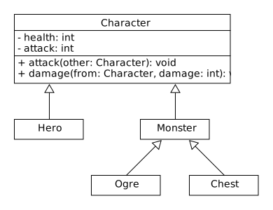

---
title:  'Lerntagebuch zur Bearbeitung von Blatt 02'
author:
- Fabian Pechta (robin_fabian.pechta@fh-bielefeld.de)
- Pascal Wilczek (pascal.wilczek@fh-bielefeld.de)
- Patrick Hüntelmann (patrick.huentelmann@fh-bielefeld.de)
...

<!--
Führen Sie zu jedem Aufgabenblatt und zum Projekt (Stationen 3-9) ein
Lerntagebuch in Ihrem Team. Kopieren Sie dazu diese Vorlage und füllen
Sie den Kopf entsprechend aus.

Im Lerntagebuch sollen Sie Ihr Vorgehen bei der Bearbeitung des jeweiligen
Aufgabenblattes vom ersten Schritt bis zur Abgabe der Lösung dokumentieren,
d.h. wie sind Sie die gestellte Aufgabe angegangen (und warum), was war
Ihr Plan und auf welche Probleme sind Sie bei der Umsetzung gestoßen und
wie haben Sie diese Probleme gelöst. Beachten Sie die vorgegebene Struktur.
Für jede Abgabe sollte ungefähr eine DIN-A4-Seite Text erstellt werden,
d.h. ca. 400 Wörter umfassen. Wer das Lerntagebuch nur ungenügend führt
oder es gar nicht mit abgibt, bekommt für die betreffende Abgabe 0 Punkte.

Checken Sie das Lerntagebuch mit in Ihr Projekt/Git-Repo ein.

Schreiben Sie den Text mit [Markdown](https://pandoc.org/MANUAL.html#pandocs-markdown).

Geben Sie das Lerntagebuch stets mit ab. Achtung: Wenn Sie Abbildungen
einbetten (etwa UML-Diagramme), denken Sie daran, diese auch abzugeben!

Beachten Sie auch die Hinweise im [Orga "Bewertung der Aufgaben"](pm_orga.html#punkte)
sowie [Praktikumsblatt "Lerntagebuch"](pm_praktikum.html#lerntagebuch).
-->

# Aufgabe

<!--
Bitte hier die zu lösende Aufgabe kurz in eigenen Worten beschreiben.
-->

 * Implementierung von Logging Mechanismen im Projekt
 * Implementierung von 2 Monstertypen
 * Zufällige Bewegung der Monster im Dungeon
 * Implementierung eines Kampfsystems
 * Neustart des Spiels beim Tod des Helden

# Ansatz und Modellierung

<!--
Bitte hier den Lösungsansatz kurz beschreiben:
-   Wie sollte die Aufgabe gelöst werden?
-   Welche Techniken wollten Sie einsetzen?
-   Wie sah Ihre Modellierung aus (UML-Diagramm)?
-   Worauf müssen Sie konkret achten?
-->

 * Das Logging soll anhand der in der "Logging"-Vorlesung gezeigten Informationen implementiert werden.
 * Zur Implementierung der Monster wurde folgendes Klassendiagramm erstellt:  
  
 * Das Kampfsystem wurde anhand dieses Modells implementiert:
Klassendiagramm des Kampfsystems:  
  

# Umsetzung

<!--
Bitte hier die Umsetzung der Lösung kurz beschreiben:
-   Was haben Sie gemacht,
-   an welchem Datum haben sie es gemacht,
-   wie lange hat es gedauert,
-   was war das Ergebnis?
-->

21.04.2021:  
 * Implementierung der Logging Mechanismen. **120 Minuten**
 * Modellierung der Monstertypen. **20 Minuten**
 * Implementierung des ersten Monstertypen (Ogre). **80 Minuten**
 * Zufällige Bewegung der Monster im Dungen. **60 Minuten**

22.04.2021:
 * Umstrukturierung des Projektes. **15 Minuten**
 * Zusammenfluss duplizierten Codes des Helden und der Monster in eine einzelne Basisklasse (Character). **30 Minuten**

24.04.2021:
 * Implementierung des Kampfsystemms. **120 Minuten**
 * Neustart des Spiels beim Tod des Helden. **30 Minuten**
 * Erweiterung des Loggings auf den neuen Code. **20 Minuten**

Ergebnis: Erweiterung des Dungeon-Spiels um Logging, gegnerische Monster und ein einfaches Kampfsystem.

# Postmortem

<!--
Bitte blicken Sie auf die Aufgabe, Ihren Lösungsansatz und die Umsetzung
kritisch zurück:
-   Was hat funktioniert, was nicht? Würden Sie noch einmal so vorgehen?
-   Welche Probleme sind bei der Umsetzung Ihres Lösungsansatzes aufgetreten?
-   Wie haben Sie die Probleme letztlich gelöst?
-->

Die Aufgaben konnten alle umgesetzt werden.

Probleme:
 * Level des Default ConsoleHandlers nicht einstellbar -> Default Handler werden weggeworfen und neue erstellt.
 * Probleme beim Pathfinder, da das Monster an einer Wand hängen blieb. -> Monster sucht sich ein neues Ziel wenn er in eine Wand läuft.
 * Nicht offensichtliche Lösung zur Umsetzung der Neustart Mechanik -> firstFrame auf True setzen
