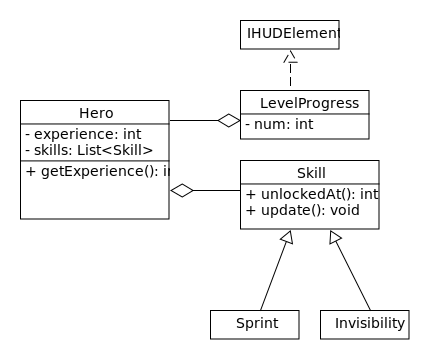
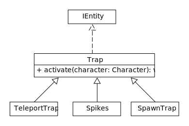

---
title:  'Lerntagebuch zur Bearbeitung von Blatt 04'
author:
- Fabian Pechta (robin_fabian.pechta@fh-bielefeld.de)
- Pascal Wilczek (pascal.wilczek@fh-bielefeld.de)
- Patrick Hüntelmann (patrick.huentelmann@fh-bielefeld.de)
...

<!--
Führen Sie zu jedem Aufgabenblatt und zum Projekt (Stationen 3-9) ein
Lerntagebuch in Ihrem Team. Kopieren Sie dazu diese Vorlage und füllen
Sie den Kopf entsprechend aus.

Im Lerntagebuch sollen Sie Ihr Vorgehen bei der Bearbeitung des jeweiligen
Aufgabenblattes vom ersten Schritt bis zur Abgabe der Lösung dokumentieren,
d.h. wie sind Sie die gestellte Aufgabe angegangen (und warum), was war
Ihr Plan und auf welche Probleme sind Sie bei der Umsetzung gestoßen und
wie haben Sie diese Probleme gelöst. Beachten Sie die vorgegebene Struktur.
Für jede Abgabe sollte ungefähr eine DIN-A4-Seite Text erstellt werden,
d.h. ca. 400 Wörter umfassen. Wer das Lerntagebuch nur ungenügend führt
oder es gar nicht mit abgibt, bekommt für die betreffende Abgabe 0 Punkte.

Checken Sie das Lerntagebuch mit in Ihr Projekt/Git-Repo ein.

Schreiben Sie den Text mit [Markdown](https://pandoc.org/MANUAL.html#pandocs-markdown).

Geben Sie das Lerntagebuch stets mit ab. Achtung: Wenn Sie Abbildungen
einbetten (etwa UML-Diagramme), denken Sie daran, diese auch abzugeben!

Beachten Sie auch die Hinweise im [Orga "Bewertung der Aufgaben"](pm_orga.html#punkte)
sowie [Praktikumsblatt "Lerntagebuch"](pm_praktikum.html#lerntagebuch).
-->


# Aufgabe

<!--
Bitte hier die zu lösende Aufgabe kurz in eigenen Worten beschreiben.
-->

 * Implementierung eines HUDs mit Elementen zur Anzeige der aktuellen Lebenspunkte und des Inventars
 * Implementierung eines Levelsystems mit Erfahrungspunkten
 * Implementierung verschiedener Fähigkeiten
 * Implementierung von Fallen, welche im Dungeon verteilt sind.

# Ansatz und Modellierung

<!--
Bitte hier den Lösungsansatz kurz beschreiben:
-   Wie sollte die Aufgabe gelöst werden?
-   Welche Techniken wollten Sie einsetzen?
-   Wie sah Ihre Modellierung aus (UML-Diagramm)?
-   Worauf müssen Sie konkret achten?
-->

### HUD

Die einzelnen HUD Elemente (z.B. eine Lebensanzeige) implementieren das Interface `IHUDElement`.  
Das Interface `IHUDElement` bietet folgende Methoden:
 * `Point getPosition()`: Gibt die Position des Elements auf dem HUD zurück.
   Die zurückgegebenen Koordinaten liegen im Bereich **x: 0 bis 6** und **y: 0 bis 5**.
 * `Texture getTexture()`: Gibt die Textur des Elements zurück. 
 * `default float getWidth()`: Breite des HUD Elements. **Defaultwert: 0.5F**
 * `default float getHeight()`: Höhe des HUD Elements. **Defaultwert: Halbe Höhe der Textur**

Die Lebensanzeige ist in der Klasse `HeartIcon` implementiert.  
Dabei stellt eine Instanz dieser Klasse einen Bereich von 100 Lebenspunkten an,  
der Bereich soll über die Eigenschaft `int num` angegeben werden (z.B. bedeutet 3 dann ein bereich von 300-399).  
Hierbei aggregiert die Klasse die Instanz des Helden um sich die aktuellen Lebenspunkte zu holen.  
Die Methoden von `IHUDElement` sollen folgendermaßen implementiert werden:  
 * `public Point getPosition()`: Soll eine statische Position auf dem HUD zurückgeben.  
 * `public Texture getTexture()`: Soll anhand der Lebenspunkte des Helden die Textur eines vollen, 
  eines halbvollen oder eines leeren Herzens anzeigen.

  ```java
  public class HeartIcon implements IHUDElement {
      private final Point position;
      private final Hero hero;
      private final int num;
      private final Texture empty;
      private final Texture half;
      private final Texture full;

      public Point getPosition() {
          return position;
      }

      public Texture getTexture() {
          final int health = Math.max(hero.getHealth() - num * 100, 0);

          if (health > 50) {
              return full;
          } else if (health > 0) {
              return half;
          }

          return empty;
      }
  }
  ```

Die Inventaranzeige soll mit der Klasse `InventoryIcon<T>` implementiert werden.
Eine einzelne Instanz der Klasse soll einen Slot im Inventar repräsentieren, deshalb aggregiert die Klasse das Inventar und besitzt den Slot im Inventar über die Eigenschaft `int slot`. 
Um auf die Gegenstände im Inventar zuzugreifen soll die Inventar-Klasse eine Methode erweitert werden:
 * `Item peek(int index)`: Gibt den Gegenstand im Inventar an dem übergebenen Index zurück, ohne den gegenstand herauszunehmen.

`InventoryIcon<T>` implementiert die Methoden von `IHUDElement` folgendermaßen:
 * `public Point getPosition()`: Soll eine statische Position auf dem HUD zurückgeben.
 * `public Texture getTexture()`: Soll die Textur des Gegenstands an der angegebenen Position im Inventar zurückgeben.

 ```java
 public class InventoryIcon<T> implements IHUDElement {
     private final Point position;
     private final Inventory<T> inventory;
     private final int slot;

     public Point getPosition() {
         return position;
     }

     public Texture getTexture() {
         return inventory.peek(slot);
     }
 }
 ```

Daraus ergibt sich folgendes UML Modell:
  

### Erfahrung und Skills

Zur Implementierung des Levelsystems soll unser Held die Zusätzliche Eigenschaft `int experience` besitzen in der die aktuellen Erfahrungspunkte gespeichert werden.

Die Darstellung des aktuellen Levels soll über ein HUD Element erfolgen, welches in der Klasse `LevelProgress` implementiert wird.
Eine Instanz der Klasse soll dabei ein einzelnes Fragment eines Fortschrittbalkens sein, der Bereich des Fragments soll über die Eigenschaft `int num` angegeben werden.
Des weiteren aggregiert die Klasse die Instanz des Helden und implementiert die Methoden des `IHUDElement` Interfaces folgendermaßen:
 * `public Point getPosition()`: Soll eine statische Position auf dem HUD zurückgeben.
 * `public Texture getTexture()`: Gibt abhängig von den Erfahrungspunkten die Textur eines leeren / vollen Fragments zurück.

 ```java
 public class InventoryIcon<T> implements IHUDElement {
     private final Point position;
     private final Hero hero;
     private final int num;
     private final Texture full;
     private final Texture empty;

     public Point getPosition() {
         return position;
     }

     public Texture getTexture() {
         final int experience = Math.min(hero.getHealth() - num * 10, 0);

         if (experience > 10) {
           return full;
         } else {
           return empty;
         }
     }
 }
 ``` 

Zur Implementierung der Fähigkeiten soll eine abstrakte Basisklasse `Skill` erstellt werden.
Diese Klasse beschreibt über folgende Methoden das Verhalten der Fähigkeit:
 * `public abstract int unlockedAt()`: Gibt das Level zurück ab dem die Fähigkeit verfügbar ist.
 * `public abstract void update()`: Update-Methode der Fähigkeit, hier wird das Verhalten der Fähigkeit implementiert.

Als erste Fähigkeit soll das Sprinten implementiert werden, welche ab Level 3 vorhanden ist.
Sobald die Fähigkeit verfügbar ist kann man der Held sich mit Betätigung der "Shift"-Taste schneller voran bewegen.

Als zweite Fähigkeit soll ein Unsichtbarkeitszauber implementiert werden.
Diese Fähigkeit soll ab Level 5 verfügbar sein, und bei Aktivierung den Helden für 20 Sekunden unsichtbar machen, nach der Aktivierung muss die Fähigkeit 60 Sekunden "abkühlen" und kann währendessen nicht verwendet werden.

Daraus ergibt sich folgendes UML Modell:
  

### Fallen

Fallen sollen über die abstrakte Basisklasse `Trap` implementiert werden. 
Diese Klasse implementiert die `IEntity` und `IDrawable` Interfaces und bietet des weiteren folgende Methode:
 * `public abstract void activate(Character character)`: Diese Methode wird aufgerufen  
   wenn der Held oder ein Monster auf dem selben Feld wie die Falle steht. 
   Dort implementieren dann die einzelnen Fallen ihr Verhalten.

Als erste Falle sollen Stacheln implementiert werden, welche zufällig und sichtbar im Dungeon verteilt sind und dem Character Schaden zufügen. Hierbei soll das Interface `IAnimatable` implementiert und dabei die passende Animation aus den Assets verwendet werden.
Die `activate`-Methode soll foldendermaßen implementiert werden:
```java
public class Spike extends Trap implements IAnimatable {
    @Override
    public void activate(Character character) {
        character.damage(5);
    }
}
```

Als nächstes soll eine Falle implementiert werden, welche bei Aktivierung durch den Helden verschiedene Monster herbeiruft.
Dieses Verhalten soll in der Klasse `SpawnTrap` umgesetzt werden. Die Falle soll nur sichtbar sein, wenn der Unsichtbarkeitszauber aktiviert ist.
```java
public class SpawnTrap extends Trap {
    @Override
    public void activate(Character character) {
        
    }
}
```

Daraus ergibt sich folgendes UML Modell:
  


# Umsetzung

<!--
Bitte hier die Umsetzung der Lösung kurz beschreiben:
-   Was haben Sie gemacht,
-   an welchem Datum haben sie es gemacht,
-   wie lange hat es gedauert,
-   was war das Ergebnis?
-->

#### 07.05.2021:
 * Implementierung der Lebensanzeige im HUD. **20 Minuten**
 * Implementierung einer Inventarhotbar im HUD. **25 Minuten**
 * Implementierung von Erfahrungspunkten und Level. **15 Minuten**
 * Implementierung einer Erfahrungs- und Levelanzeige im HUD. **25 Minuten**
 * Implementierung einer Unsichtbarkeitsfähigkeit. **20 Minuten**
 * Implementierung einer Stachelfalle. **35 Minuten**
 * Implementierung einer Falle, die bei Berührung Monster herbeiruft. **30 Minuten**

#### 08.05.2021:
 * Implementierung eines Inventarbildschirms für "fremde" Inventare. **25 Minuten**
 * Implementierung einer Sprintfähigkeit. **15 Minuten**
 * Einschiebung eines Angriffbonus bei Levelfortschritt. **10 Minuten**


# Postmortem

<!--
Bitte blicken Sie auf die Aufgabe, Ihren Lösungsansatz und die Umsetzung
kritisch zurück:
-   Was hat funktioniert, was nicht? Würden Sie noch einmal so vorgehen?
-   Welche Probleme sind bei der Umsetzung Ihres Lösungsansatzes aufgetreten?
-   Wie haben Sie die Probleme letztlich gelöst?
-->

Die dürchgeführte Konzeptionierung erleichterte die Phase der Umsetzung.

Des weiteren verlief die Umsetzung Problemlos.
