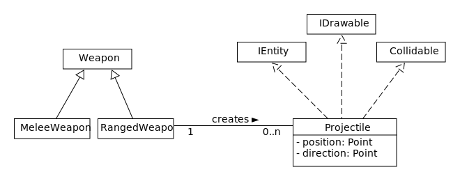
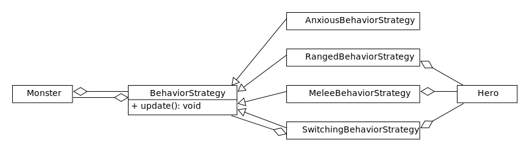
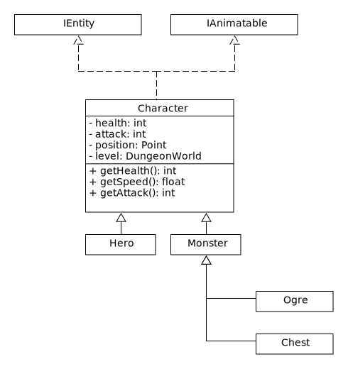

---
title:  'Lerntagebuch zur Bearbeitung von Blatt 05'
author:
- Fabian Pechta (robin_fabian.pechta@fh-bielefeld.de)
- Pascal Wilczek (pascal.wilczek@fh-bielefeld.de)
- Patrick Hüntelmann (patrick.huentelmann@fh-bielefeld.de)
...

<!--
Führen Sie zu jedem Aufgabenblatt und zum Projekt (Stationen 3-9) ein
Lerntagebuch in Ihrem Team. Kopieren Sie dazu diese Vorlage und füllen
Sie den Kopf entsprechend aus.

Im Lerntagebuch sollen Sie Ihr Vorgehen bei der Bearbeitung des jeweiligen
Aufgabenblattes vom ersten Schritt bis zur Abgabe der Lösung dokumentieren,
d.h. wie sind Sie die gestellte Aufgabe angegangen (und warum), was war
Ihr Plan und auf welche Probleme sind Sie bei der Umsetzung gestoßen und
wie haben Sie diese Probleme gelöst. Beachten Sie die vorgegebene Struktur.
Für jede Abgabe sollte ungefähr eine DIN-A4-Seite Text erstellt werden,
d.h. ca. 400 Wörter umfassen. Wer das Lerntagebuch nur ungenügend führt
oder es gar nicht mit abgibt, bekommt für die betreffende Abgabe 0 Punkte.

Checken Sie das Lerntagebuch mit in Ihr Projekt/Git-Repo ein.

Schreiben Sie den Text mit [Markdown](https://pandoc.org/MANUAL.html#pandocs-markdown).

Geben Sie das Lerntagebuch stets mit ab. Achtung: Wenn Sie Abbildungen
einbetten (etwa UML-Diagramme), denken Sie daran, diese auch abzugeben!

Beachten Sie auch die Hinweise im [Orga "Bewertung der Aufgaben"](pm_orga.html#punkte)
sowie [Praktikumsblatt "Lerntagebuch"](pm_praktikum.html#lerntagebuch).
-->

# Aufgabe

<!--
Bitte hier die zu lösende Aufgabe kurz in eigenen Worten beschreiben.
-->

 * Implementierung von Fernkampfwaffen
 * Implementierung unterschiedlicher Verhaltenstrategien der Monster
 * Refactoring

# Ansatz und Modellierung

<!--
Bitte hier den Lösungsansatz kurz beschreiben:
-   Wie sollte die Aufgabe gelöst werden?
-   Welche Techniken wollten Sie einsetzen?
-   Wie sah Ihre Modellierung aus (UML-Diagramm)?
-   Worauf müssen Sie konkret achten?
-->

### Fernkampfwaffen

Zur Implementierung der Fernkampfwaffen wurde zunächst die existierende Klasse `Weapon` in die Unterklassen `MeleeWeapon` (für Nahkampfwaffen) und `RangedWeapon` (für Fernkampfwaffen) abstrahiert.
In der Basisklasse `Weapon` befindet sich nun nur noch die Eigenschaften und Funktionalitäten, welche für beide Waffentypen benötigt werden.
Und in der Klasse `MeleeWeapon` befinden sich nun die Eigenschaften und Funktionalitäten, welche aus der Klasse `Weapon` entfernt wurden.
Die Klasse `RangedWeapon` bildet das Verhalten einer Fernkampfwaffe ab, hierzu wurde eine weitere Klasse `Projectile` modelliert, welche ein einzelnes Projektil der Fernkampfwaffe abbildet.
`Projectile` implementiert die Interfaces `IEntity`, `IDrawable` und `Collidable` und besitzt folgende Eigenschaften:
 * `Point position`: Aktuelle Position des Projektils
 * `Point direction`: Richtung des Projektils, 
    in der `update()`-Methode wird die Position des Position des Projektils um diesen Vektor verschoben.

Daraus ergibt sich folgendes UML Modell:

### Verhaltensstrategien

Die unterschiedlichen Verhaltensstrategien der Monster sollen mittels dem Strategy-Pattern abgebildet werden.
Hierbei gibt es eine abstrakte Basisklasse `BehaviorStrategy`, welche von den konkreten Klassen `AnxiousBehaviorStrategy`, `RangedBehaviorStrategy` und `MeleeBehaviorStrategy` implementiert werden. 

Die Implementierung `AnxiousBehaviorStrategy` soll sich dabei immer möglichst von Helden fern halten.
Die Implementierung `RangedBehaviorStrategy` soll den Helden auf Distanz halten aber aktiv mit einer Fernkampfwaffe angreifen.
Die Implementierung `MeleeBehaviorStrategy` soll sich immer den Helden nähern und diesen angreifen.
Zudem soll es eine weitere Klasse `SwitchingBehaviorStrategy` geben, welche die `RangedBehaviorStrategy`, `MeleeBehaviorStrategy` und den Helden aggregiert und abhängig von der Nähe zum Helden den Aufrufe an die entsprechenden konkreten Implementierungen weitergibt.

`BehaviorStrategy` hat folgende Methoden:
 * `abstract void update(Monster monster);`: In dieser Methode werden von den konkreten Ableitungen das entsprechende Verhaltensmuster implementiert.

Daraus ergibt sich folgendes UML Modell:

### Refactoring

#### Code Quality / Code Style:

Zur Einführung einer einheitlichen Codequalität soll mit dem Analyzer "CheckStyle" und dem Google Stylevorgaben gearbeitet werden.
Hierbei muss einmal durch das Projekt gegangen werden und die entprechenden Stellen überarbeitet werden.
Dabei sollen auch fehldende Dokumentation nachgetragen werden.

#### Kollisionsabfrage mit Hashtable

Um die Kollisionsabfrage zu optimieren soll die Klasse `CollisionController` um eine Hashtable Implementierung erweitert werden, mit der die Objekte auf der gleichen Position gespeichert werden.
Bevor eine Änderung an der Klasse `CollisionController` durchgeführt wird soll ein Test für diese Klasse entworfen werden.

Dazu wurde folgendes UML Modell erstellt:

#### OOP-Character

Die aktuelle Implementierung der Charaktere verfolgt bereits eine Klassen- Struktur.

Auszug aus dem UML Modell der Charaktere:

# Umsetzung

<!--
Bitte hier die Umsetzung der Lösung kurz beschreiben:
-   Was haben Sie gemacht,
-   an welchem Datum haben sie es gemacht,
-   wie lange hat es gedauert,
-   was war das Ergebnis?
-->

#### 13.05.2021:
 * Aufteilung der Waffen-Klasse in eine Basisklasse und eine Nahkampf-Klasse. **25 Minuten**
 * Implementierung der Fernkampfwaffenklasse. **35 Minuten**
 * Implementierung der Maussteuerung für die Fernkampfwaffen. **20 Minuten**
 * Extrahierung des Verhaltenscodes aus der `Monster`-Klasse in die Strategieklassen `BehaviorStrategy` und `AnxiousBehaviorStrategy`. **25 Minuten**
 * Implementierung der Nahkampf Verhaltensstrategie. **30 Minuten**
 * Implementierung der Fernkampf Verhaltensstrategie. **35 Minuten**
 * Lösen der `CheckStyle`-Fehler. **40 Minuten**
 * Implementierung des Tests des `CollisionController`. **15 Minuten**
 * Implementierung der Kollisionsabfrage mittels Hashtable. **30 Minuten**

# Postmortem

<!--
Bitte blicken Sie auf die Aufgabe, Ihren Lösungsansatz und die Umsetzung
kritisch zurück:
-   Was hat funktioniert, was nicht? Würden Sie noch einmal so vorgehen?
-   Welche Probleme sind bei der Umsetzung Ihres Lösungsansatzes aufgetreten?
-   Wie haben Sie die Probleme letztlich gelöst?
-->

Während der Umsetzung des Lösungsansatzes sind keine nennenswerten Probleme aufgetreten.